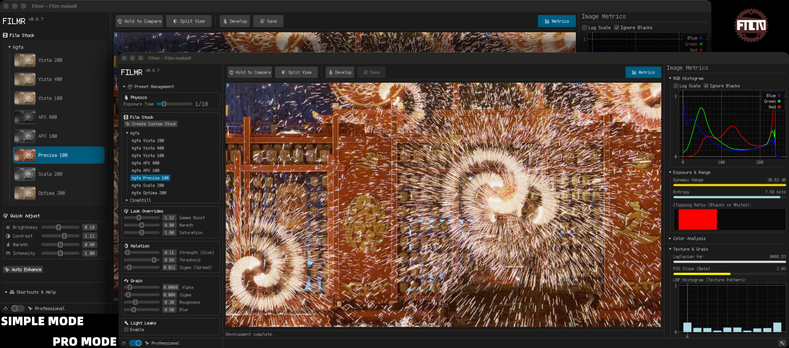

# Filmr

<p align="center">
  
</p>

<p align="center">
  <strong>FilmeR / Film Rust</strong>
</p>

<p align="center">
  <a href="https://crates.io/crates/filmr">
    
  </a>
  <a href="https://github.com/W-Mai/filmr/blob/main/LICENSE">
    
  </a>
  <a href="https://crates.io/crates/filmr">
    
  </a>
</p>

**Filmr** is a high-fidelity, physics-based film simulation engine written in Rust. Unlike simple LUT-based filters, Filmr simulates the physical properties of photographic film—from spectral sensitivity and grain structure to chemical development curves—to produce authentic, organic results.



## 📖 Table of Contents

- [Core Features](#-core-features)
- [Quick Start](#-quick-start)
- [Installation](#-installation)
- [Supported Film Stocks](#-supported-film-stocks)
- [Project Structure](#-project-structure)
- [License](#-license)

## 🚀 Core Features

Filmr implements a comprehensive imaging pipeline that models the physical behavior of analog film:

- **🔬 Spectral Simulation**: Accurate modeling of film spectral sensitivity (Panchromatic, Orthochromatic, Infrared) using physical wavelength data.
- **🌾 Physics-Based Grain**: Spatially correlated grain synthesis based on RMS granularity and blur radius, simulating the organic texture of silver halide crystals.
- **📈 H-D Curves**: Segmented characteristic curves (D-min, D-max, Gamma) for realistic tonal response and density formation.
- **✨ Halation & Bloom**: Physical light scattering simulation (Gaussian diffusion) to recreate the signature "glow" of bright highlights on film.
- **⏱️ Reciprocity Failure**: Simulation of film speed loss during long exposures (Schwarzschild effect).
- **🎨 30+ Film Presets**: Built-in profiles for legendary stocks like Kodak Portra, Tri-X, Fujifilm Velvia, and Kodachrome.
- **📊 Diagnostic Tools**: Integrated quality verification and visualization tools for analyzing color science and signal metrics.
- **⚡ High Performance**: Parallelized image processing using `rayon` for fast rendering.

## ⚡ Quick Start

### 1. Run the GUI Demo
The interactive GUI allows you to drag-and-drop images and tweak simulation parameters in real-time.

```bash
cargo run -p filmr_app --bin filmr_ui --release
```

### 2. Generate Diagnostic Charts
Visualize the color response, grain structure, and spectral characteristics of all supported films.

```bash
cargo run --example chart_diagnosis --release
```
*Output will be saved to `diagnosis_output/contact_sheet.jpg`.*

## 📦 Installation

### Install from Binary

#### MacOS (Homebrew)
```bash
brew install W-Mai/cellar/filmr_app
```

#### Windows (PowerShell)
```powershell
irm https://github.com/W-Mai/filmr/releases/latest/download/filmr_app-installer.ps1 | iex
```

#### Linux / MacOS (Shell)
```bash
curl --proto '=https' --tlsv1.2 -LsSf https://github.com/W-Mai/filmr/releases/latest/download/filmr_app-installer.sh | sh
```

### Build from Source

#### Prerequisites
- [Rust Toolchain](https://www.rust-lang.org/tools/install) (1.70 or later)

#### Steps

1. **Clone the repository**
   ```bash
   git clone https://github.com/w-mai/filmr.git
   cd filmr
   ```

2. **Build the project**
   ```bash
   cargo build --release
   ```

3. **Run tests**
   ```bash
   cargo test
   ```

## 🎞️ Supported Film Stocks

Filmr includes over 30 calibrated film presets, categorized by type:

| Category | Examples |
|----------|----------|
| **Fujifilm Slide (E-6)** | Velvia 50/100, Provia 100F/400X, Astia 100F |
| **Fujifilm Negative (C-41)** | Pro 400H, Superia 200/800, Pro 160NS |
| **Kodak Color Negative** | Portra 160/400, Ektar 100, Gold 200 |
| **Kodak B&W** | Tri-X 400, T-Max 100/400/3200, Plus-X 125 |
| **Ilford B&W** | HP5+, FP4+, Delta 100/400/3200, Pan F+, SFX 200 |
| **Vintage / Discontinued** | Kodachrome 25/64, Polaroid SX-70 |

## 📄 License

This project is open source and available under the **MIT License**.
